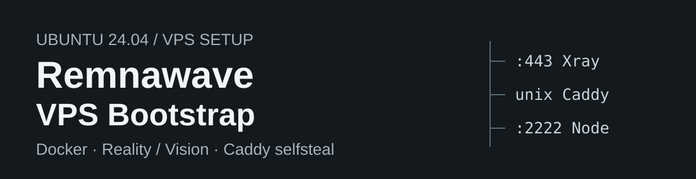
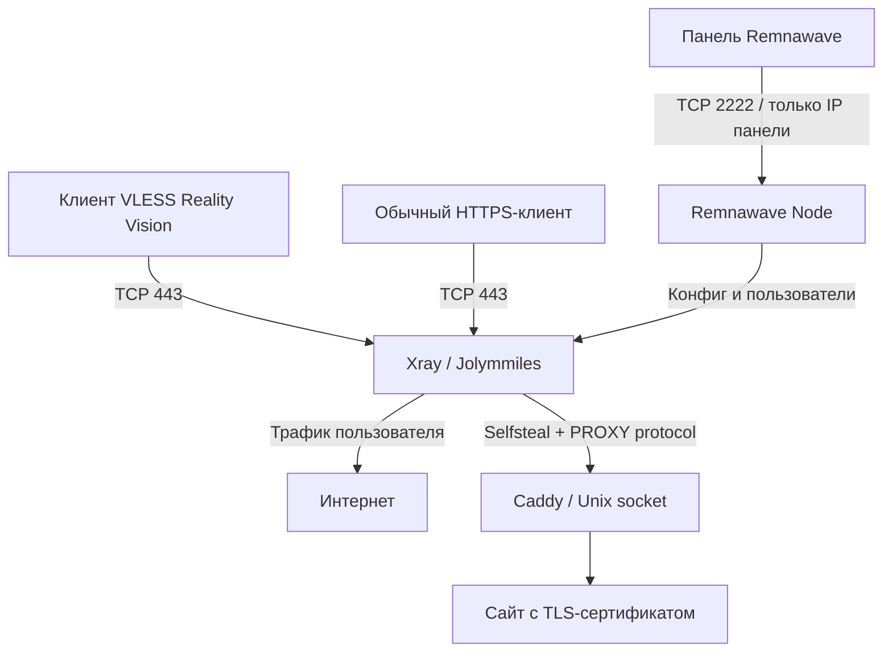

<p align="center">
  
</p>

# Remnawave VPS Bootstrap

[](https://github.com/Nano35/remnawave-vps-bootstrap/actions/workflows/checks.yml)

Первоначальная настройка Ubuntu 24.04 VPS: Docker, нода Remnawave, VLESS TCP Reality с Vision, Caddy selfsteal и форк Xray от Jolymmiles. Панель Remnawave должна быть установлена отдельно.

**Проверено на реальном VPS:** подключение ноды к панели, HTTPS selfsteal и внешний запрос через VLESS Reality Vision. [Результаты проверки →](docs/VERIFICATION.md)

## Быстрый запуск

На новом VPS с Ubuntu 24.04:

```bash
sudo apt-get update
sudo apt-get install -y git
git clone https://github.com/Nano35/remnawave-vps-bootstrap.git
cd remnawave-vps-bootstrap
sudo bash bootstrap.sh
```

Репозиторий приватный: для `git clone` требуется авторизация GitHub. Можно скачать ZIP через GitHub и загрузить распакованную папку на VPS. Все `.sh` и `.py` файлы должны оставаться рядом.

Скрипт попросит:

1. Домен ноды с A-записью на IPv4 VPS.
2. Публичный исходящий IPv4 панели.
3. HTTPS URL панели — целиком, если используется секретный параметр входа.
4. Уникальное имя ноды и API-токен.
5. Опции BBR, DNS-over-TLS и мониторинга, затем Internal Squad для пользователей.

**URL и токен вводятся видимо.** Не записывайте терминальную сессию во время ввода. Секретная ссылка и API-токен не сохраняются в состоянии установки.

Сначала проверить только доступ к API:

```bash
sudo bash bootstrap.sh --check-api
```

## Что настраивается

| Компонент | Результат |
| --- | --- |
| Ubuntu | Обновление apt-пакетов |
| Docker и Compose | Использование имеющихся, установка отсутствующих |
| Reverse proxy | Закреплённая версия установщика eGamesAPI |
| Remnawave | Config Profile, Node, Host и подключение к панели |
| Xray | VLESS TCP Reality, Vision для клиентов и индивидуальные ключи |
| Selfsteal | Caddy с настоящим TLS-сертификатом через Unix socket |
| Форк | Jolymmiles `v26.9.5-0936`, проверка SHA256 и работающего процесса |
| Firewall | Сохранение SSH; порт ноды 2222 доступен только панели |
| Восстановление | Резервные копии; автоматический откат при ошибке замены ядра |

При повторном запуске используются сохранённые UUID, Reality-ключи и Docker image digest. Существующие чужие файлы и объекты панели вызывают остановку, чтобы избежать перезаписи.

## Как работает selfsteal



Caddy использует `/dev/shm/nginx.sock`, не занимает TCP 443 и получает сертификат через HTTP-01 на TCP 80. Панель добавляет пользователей в конфиг ноды. Если пропустить выбор Internal Squad, добавьте `VLESS_REALITY` в нужную группу вручную.

## Требования

- Ubuntu 24.04, root или sudo, новый VPS без существующего стека на `/opt/remnanode`.
- Домен ноды без CDN proxy и AAAA, A-запись на IPv4 VPS.
- Свободные TCP 80, 443 и 2222; доступные SSH и HTTPS API панели.
- API-токен с правами на профили, ноды, хосты, ключи и Internal Squads.
- Для временного теста и его очистки — права создания/удаления пользователей и групп.

Firewall провайдера настраивается отдельно. Первый запуск выбирает актуальные upstream-образы и сохраняет их digest; будущие версии панели или образов требуют собственной проверки совместимости.

## Дополнительные опции

- **BBR/fq:** проверка поддержки ядром и сохранение исходных sysctl; по умолчанию выключено.
- **Unbound + DNS-over-TLS:** локальный resolver, кеш, проверка доступности до переключения DNS; по умолчанию выключено.
- **Мониторинг:** контейнеры, фактическое ядро, свободное место и TLS-сертификат каждые пять минут; по умолчанию включено. Неизменное здоровое состояние проходит без событий.
- **Webhook:** опциональные JSON-уведомления при проблеме и восстановлении.
- **Внешний тест:** отдельная группа и пользователь на час с лимитом 100 MiB.

## Проверка и откат

Создать временный тестовый доступ после установки:

```bash
sudo bash bootstrap.sh --test-user
```

Перенесите `/var/lib/remna-bootstrap/external-test.json` и `external-test.sh` по защищённому каналу на другую Linux-машину с современным Xray и curl:

```bash
bash external-test.sh external-test.json
```

Удалить тестовые объекты на VPS:

```bash
sudo bash bootstrap.sh --cleanup-test
```

Откат к резервной копии, которую вывел установщик:

```bash
sudo bash rollback.sh /var/lib/remna-bootstrap/backups/ИМЯ_КОПИИ
```

Откат восстанавливает конфигурацию и принадлежащие запуску объекты панели. Обновлённые apt-пакеты, Docker-образы и сертификаты остаются. [Подробности →](docs/OPERATIONS.md#резервные-копии-и-откат)

## Документация

- [Эксплуатация, диагностика API и поведение повторного запуска](docs/OPERATIONS.md)
- [Проверка на реальном VPS и её ограничения](docs/VERIFICATION.md)
- [Разработка и тесты](CONTRIBUTING.md)

Состояние, резервные копии и ключи находятся в `/var/lib/remna-bootstrap`, стек — в `/opt/remnanode`. Эти каталоги и тестовые клиентские конфиги не должны попадать в Git.

## Исходные проекты

- [Remnawave](https://github.com/remnawave)
- [eGamesAPI/remnawave-reverse-proxy](https://github.com/eGamesAPI/remnawave-reverse-proxy) — установка стека и замена ядра.
- [Jolymmiles/Xray-core](https://github.com/Jolymmiles/Xray-core) — используемый форк.
- [Caddy](https://github.com/caddyserver/caddy) — сайт selfsteal и сертификаты.

Исходники и бинарники сторонних проектов загружаются во время установки и распространяются на условиях своих лицензий. Этот репозиторий содержит адаптер настройки и вспомогательные скрипты.
